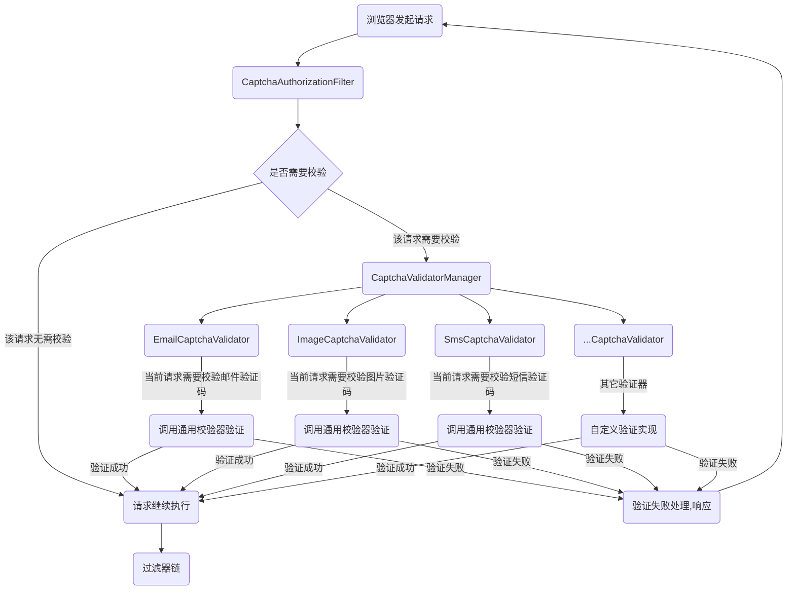
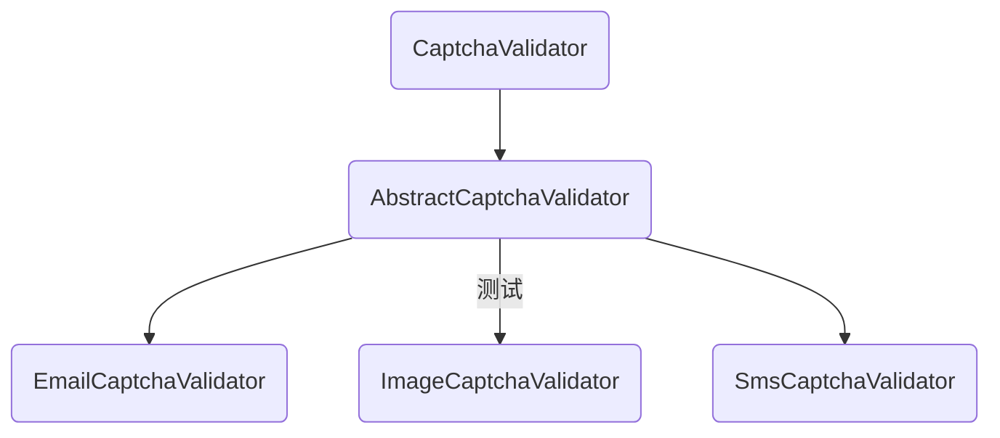
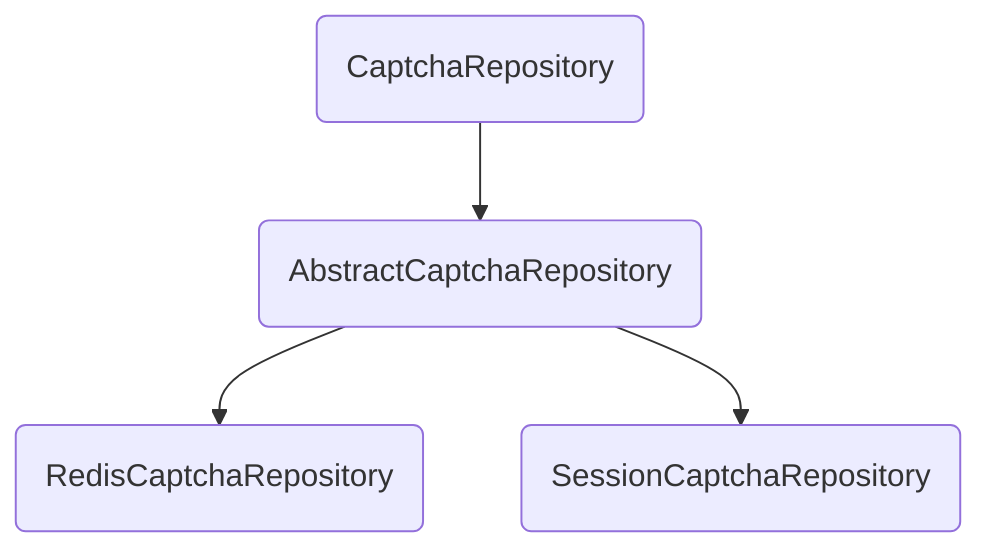

# 简介

该项目是对`Spring OAuth2 Authorization Server`的一个封装，利用`Spring Boot`
自动配置的特点可以快速的集成`Spring Authorization Server`框架，引入`starter`
后可以很方便的使用`Spring Authorization Server`原有功能，并且扩展功能也可以像其它`Security`的`DSL`配置方式进行配置。

# 为什么要封装？

之前出过一篇系列文章，读者在学习时总是会在各种莫名其妙的地方踩到坑，不小心错漏一个地方都需要排查半天；所以当时就萌生了一个封装`starter`
的想法，将一些扩展的功能以`DSL`的形式配置进认证服务的过滤器链中，直至现在算是有了一个雏形。

# 版本基础

- Spring Boot 3.2.1
- Spring Authorization Server
- Spring Data Redis(可选)
- Spring OAuth2 Client(可选)

**这些依赖都随引用项目的`SpringBoot`版本决定使用的版本，如果以后无重大版本变化，则升级`SpringBoot`版本即可**。

# 特性列表

- [x] 全局验证码过滤器
- [x] 短信登录(只负责验证)
- [x] 邮箱登录(只负责验证)
- [x] OAuth2密码模式
- [x] 三方登录微信登录适配
- [x] 提供基于Redis的核心服务实现

# 快速开始

1. 拉取代码

```shell
git clone https://gitee.com/vains-Sofia/oauth2-security-spring-boot-starter.git
```

2. 安装至本地库

```shell
mvn clean install
```

3. 在使用的项目中引入Maven坐标

```xml

<dependency>
    <groupId>com.vains</groupId>
    <artifactId>oauth2-security-spring-boot-starter</artifactId>
    <version>0.0.1</version>
</dependency>
```

4. 添加认证服务配置，在认证服务配置中添加密码模式支持

```java
/**
 * 配置端点的过滤器链
 *
 * @param http spring security核心配置类
 * @return 过滤器链
 * @throws Exception 抛出
 */
@Bean
public SecurityFilterChain authorizationServerSecurityFilterChain(HttpSecurity http)throws Exception{
    // 自定义配置 (重要：必须写在OAuth2AuthorizationServerConfiguration.applyDefaultSecurity(http);之前，让该自定义配置在
    // OAuth2AuthorizationServerMetadataEndpointConfigurer配置之前)
    // 添加密码模式
    http.with(new ResourceOwnerPasswordConfigurer(),Customizer.withDefaults());

    // 配置默认的设置，忽略认证端点的csrf校验
    OAuth2AuthorizationServerConfiguration.applyDefaultSecurity(http);

    http.getConfigurer(OAuth2AuthorizationServerConfigurer.class);
    // 其它认证服务配置

    return http.build();
}
```

5. 添加资源服务器配置，在资源服务配置中添加邮箱、短信登录

```java
/**
 * 配置认证相关的过滤器链
 *
 * @param http spring security核心配置类
 * @return 过滤器链
 * @throws Exception 抛出
 */
@Bean
public SecurityFilterChain defaultSecurityFilterChain(HttpSecurity http)throws Exception{    // ... 其它资源服务配置

    http.with(new BasicLoginConfigurer(),basicLoginConfigurer->basicLoginConfigurer
        // 添加短信登录，默认登录接口：/login/sms
        .smsCaptchaLogin(Customizer.withDefaults())
        // 添加邮件登录，默认登录接口：/login/email
        .emailCaptchaLogin(Customizer.withDefaults())
        // 当添加了短信登录或者邮件登录的配置时，默认添加验证码过滤器(这两种登录方式依赖验证码校验)，或如下显示添加验证码配置
        .captchaAuthorization(Customizer.withDefaults())
    );

    // ... 其它资源服务配置

    return http.build();
}
```

6. 生成验证码接口需要调用CaptchaRepository保存验证码信息

```java
/**
 * 验证码接口
 *
 * @author vains
 */
@Slf4j
@RestController
@RequiredArgsConstructor
@RequestMapping("/captcha")
public class CaptchaController {

    private final CaptchaRepository captchaRepository;

    @GetMapping("/image")
    public BasicCaptcha imageCaptcha(HttpServletRequest request,
                                     HttpServletResponse response) {
        // 生成验证码

        ImageCaptcha imageCaptcha = new ImageCaptcha();
        imageCaptcha.setCode...
        imageCaptcha.setType(CaptchaType.IMAGE_CAPTCHA);

        captchaRepository.save(new ServletWebRequest(request, response), imageCaptcha);
        return imageCaptcha;
    }

    @GetMapping("/sms")
    public BasicCaptcha smsCaptcha(@NotBlank @RequestHeader String phone,
                                   HttpServletRequest request,
                                   HttpServletResponse response) {
        // 生成验证码
        log.debug("手机号[{}]获取验证码", phone);
        BasicCaptcha captcha = new BasicCaptcha();
        // 默认 1234
        captcha.setCode...
        captcha.setType(CaptchaType.SMS_CAPTCHA);

        captchaRepository.save(new ServletWebRequest(request, response), captcha);
        return captcha;
    }

    @GetMapping("/email")
    public BasicCaptcha emailCaptcha(HttpServletRequest request,
                                     HttpServletResponse response) {

        // 生成验证码
        BasicCaptcha captcha = new BasicCaptcha();
        captcha.setType(CaptchaType.EMAIL_CAPTCHA);
        // ...

        captchaRepository.save(new ServletWebRequest(request, response), captcha);
        return captcha;
    }

}

```

**`CaptchaRepository`默认有两个实现，一个基于session，一个基于redis，当引入`spring-boot-starter-data-redis`依赖后自动使用基于redis的验证码存储库，否则使用基于session的验证码存储库。**

# 配置说明

## `ResourceOwnerPasswordConfigurer`

需要将它放在认证服务配置的第一行主要是为了在访问`/.well-known/openid-configuration`
时可以获取到自己添加的这个grant_type，否则获取不到，配置中也限制了只能添加在认证服务配置中。

| 配置                                | 说明                                                    | 默认                                          |
|:----------------------------------|:------------------------------------------------------|:--------------------------------------------|
| usernameParameter                 | 设置密码模式登录账号的参数名                                        | username                                    |
| passwordParameter                 | 设置密码模式登录密码的参数名                                        | password                                    |
| passwordGrantType                 | 设置密码模式登录的grant_type值                                  | password                                    |
| tokenGenerator                    | 设置密码生成器                                               | HttpSecurity获取 --->>> 从ioc中获取 --->>> 创建一个实例 |
| authenticationProvider            | 设置用户认证逻辑                                              | DaoAuthenticationProvider                   |
| authorizationService              | 管理OAuth2流程中的认证信息                                      | HttpSecurity获取 --->>> 从ioc中获取 --->>> 创建一个实例 |
| grantAuthenticationTokenGenerator | 自定义AuthenticationToken的生成，与authenticationProvider配合使用 | 默认生成UsernamePasswordAuthenticationToken     |

## 短信登录和邮件登录的配置

这两个配置类都继承自`AbstractAuthenticationFilterConfigurer`，也就是说这两个的配置项是和表单登录(`Security`
默认提供的`formLogin`配置项)的配置是一致的。

## 配置项`captchaAuthorization`对应的配置类`CaptchaAuthorizationConfigurer`

| 配置                    | 说明                                                         | 默认                                                     |
| :---------------------- | :----------------------------------------------------------- | :------------------------------------------------------- |
| captchaValidatorManager | 验证码校验管理器                                             | ioc中获取 --->>> DefaultCaptchaValidatorManager          |
| captchaValidator        | 验证码校验器，如果设置该配置则默认的会被覆盖                 | 短信、邮件、图片验证码校验                               |
| requestMatcher          | 设置验证码类型，对应需要检验的请求的地址、方式，验证码的参数名、获取验证码时的唯一id | 短信、邮件登录默认表单登录                               |
| failureHandler          | 验证码校验失败处理                                           | 默认根据请求来源处理，页面请求跳转页面，ajax请求响应JSON |

`requestMatcher`提供了多个重载的方法，可以简化写法;
关于requestMatcher也提供了yml的配置，如下

```yaml
vains:
  captcha:
    validate:
      # 这里的image是type
      image:
        # code-parameter参数是验证码值的key
        code-parameter: image
        # 拦截的url(默认post)，自己设置请求方式可以使用matcher-infos配置项
        request-uris: /captcha/sms,/captcha/email
        # request-uris配置项的配置实际上最终转换为matcher-infos了，所以两者等同，自选其一即可
        matcher-infos:
          # 请求地址
          - url: /captcha/sms
            # 请求方式
            http-method: POST
        # 设置image类型的验证码id在请求头/参数中的key
        cache-key: deviceId
```


# 原理

## 验证码校验

### 验证码校验流程

在验证码过滤器中根据当前请求在`CaptchaValidatorManager`中找到对应的验证码校验器，然后对当前请求进行校验，如果校验通过请求继续执行，校验失败调用配置的`failureHandler`进行验证失败处理。



### 默认验证器说明

默认内置了三个验证器：`EmailCaptchaValidator`、`ImageCaptchaValidator`和`SmsCaptchaValidator`，它们三个在引入依赖后会自动注入，调用的都是验证码的统一校验，在这三个校验器中根据配置(`requestMatcher/yml`)决定是否需要校验和封装参数调用统一验证码校验处理。**它们在IOC中的名称分别是`email`、`image`和`sms`，如果想重写对应的校验逻辑只需要在注入时设置bean的名字即可覆盖。**

### 验证器扩展说明

`starter`提供了`AbstractCaptchaValidator`类，继承该类注入ioc后会**自动根据bean名称去找验证码配置(`requestMatcher/yml`)中的配置，根据配置自动拦截、校验配置的请求路径**，验证码配置(`requestMatcher/yml`)中的type和bean的名字是对应的，所以**如果继承该类实现自己的校验逻辑记得要一一对应。**

`starter`中注入代码如下，去掉`@ConditionalOnMissingBean(name = ...)`注解，注入自己的实现即可

```java
@Bean(DefaultConstants.SMS_CAPTCHA_VALIDATE)
@ConditionalOnMissingBean(name = DefaultConstants.SMS_CAPTCHA_VALIDATE)
public CaptchaValidator smsCaptchaValidator(CaptchaRepository captchaRepository) {
    return new SmsCaptchaValidator(captchaRepository, captchaValidateProperties);
}

@Bean(DefaultConstants.EMAIL_CAPTCHA_VALIDATE)
@ConditionalOnMissingBean(name = DefaultConstants.EMAIL_CAPTCHA_VALIDATE)
public CaptchaValidator emailCaptchaValidator(CaptchaRepository captchaRepository) {
    return new EmailCaptchaValidator(captchaRepository, captchaValidateProperties);
}

@Bean(DefaultConstants.IMAGE_CAPTCHA_VALIDATE)
@ConditionalOnMissingBean(name = DefaultConstants.IMAGE_CAPTCHA_VALIDATE)
public CaptchaValidator imageCaptchaValidator(CaptchaRepository captchaRepository) {
    return new ImageCaptchaValidator(captchaRepository, captchaValidateProperties);
}
```

### `CaptchaValidator`继承类图



## 验证码存储

### 默认验证码存储结构

验证码存储是通过实现`CaptchaRepository`接口来实现存储，接口中提供了三个抽象方法对验证码进行操作，`AbstractCaptchaRepository`抽象类实现了该接口，并提供了获取缓存`key`的方法，子类可直接使用，**但是限制了子类在实例化时必须传入`CaptchaValidateProperties`的实例，因为要根据验证码类型获取配置文件中配置的`缓存key`在请求头/请求参数中的`key`**，这里就跟前面说明配置的地方对应上了。

### 默认实现

默认有两个实现，一个基于Redis、一个基于session存储，分别是`RedisCaptchaRepository`和`SessionCaptchaRepository`，如果项目有引入`spring-boot-starter-data-redis`会自动注入`RedisCaptchaRepository`，否则会自动注入`SessionCaptchaRepository`，**如果想使用自己的存储实现，可以直接注入自己的实现，如下：**

```java
@Bean
public CaptchaRepository sessionCaptchaRepository(CaptchaValidateProperties captchaValidateProperties) {
    return new SessionCaptchaRepository(captchaValidateProperties);
}
```

上方配置即可替换默认行为。

### `CaptchaRepository`类图



## 短信登录、邮件登录
这两个处理登录的过滤器都是继承自`AbstractAuthenticationProcessingFilter`，与默认的`UsernamePasswordAuthenticationFilter`过滤器逻辑基本一致，唯一的区别就是过滤器内生成token不同，因为这两种方式不需要校验密码(过滤器链最前边有验证码过滤器)，所以交给各自的`provider`处理，配置类也跟原配置中的formLogin配置基本一致，跟原生账号密码登录配置是一样的配置方式。

